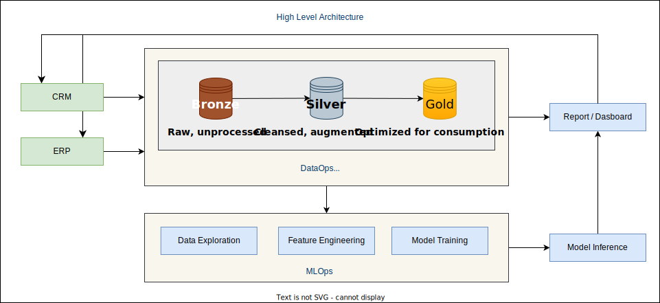

# Analytics and ML for Enterprise Business Applications

## Introduction

Enterprise Business Applications have traditionally been used for managing and automating core business processes and operations. These applications are designed to integrate and streamline various business functions such as finance, accounting, human resources, supply chain management, and customer relationship management.

Due to the nature of these applications, the data they generate is a great asset to drive insight on how to streamline operations, optimize processes, improve decision making and enhance customer experience. For example, ERP systems can provide organizations with a wealth of data on their operations and processes. By analyzing this data, organizations can identify areas of improvement and optimize their processes to increase efficiency. Another example is, by gaining insights into customer data through the CRM systems, organizations can provide more personalized experiences to their customers.

Modern analytics and data warehousing tools are used to collect, process and analyze data from these applications. This is further improved by doing predictive analytics using machine learning techniques.

There are some common architectural patterns of deployment and usages of the enterprise business applications across different organizations which results in reusable patterns of how to do advanced analytics and machine learning on top of these applications. The purpose of this solution is to curate these reusable patterns.

## High Level Architecture

There is a large set of business applications and different vendors offer the applications in slightly different flavor. But regardless of the type of the applications, analytics and machine learning on top of these systems will involve some common steps, like data ingestion from multiple sources, standardizing the data (data cleansing, data quality etc.) and developing a curated layer for consumption (data modelling, aggregation etc.). DataOps provides the best practices around the ingestion, transformation and serving of the data.

The curated layer of data is used to develop reports and dashboards to address use cases like one view of customer, profit and loss dashboards etc. For more complex use cases, machine learning models are trained using the data. Some examples of such use cases are customer churn prediction, predictive maintenance, fraud detection etc. Training ML models and using them for inference within reports/dashboards involves additional steps that include data exploration by ML engineers/ data scientists, feature engineering and model training,

In many cases, these reports/dashboards are published to the business apps, so that the end users can access them easily.

The following diagram presents a traditional high level architecture of doing DataOps and MLOps on top of two business apps - CRM and ERP.

Real life implementation can be different from this architecture depending on the choice of the technology and requirements.

## Architectural Patterns

Architectural patterns refer to reusable solutions that can be applied to common problems in software development. The following section presents sample implementation of analytics and machine learning for specific enterprise business application.

- [Data Lakehouse - Microsoft Dynamics 365 and Azure Databricks](./architectural-patterns/dynamics-365-databricks/README.md)

## References

- [DataOps - Modern Data Warehouse](https://www.ms-playbook.com/code-with-dataops/solutions/modern-data-warehouse/)

  The Modern Data Warehouse (MDW) is a common architectural pattern to build analytical data pipelines in a cloud-first environment. The MDW pattern is foundational to enable Advanced Analytical workloads such as Machine Learning alongside more traditional analytics such as Business Intelligence.
- [ML Development and Operations in Azure Databricks](https://www.ms-playbook.com/code-with-mlops/solutions/mlops-in-databricks/)

  Databricks is a product of choice to run analytical workflows on big datasets for many customers. The key benefits of Databricks are: supporting of different kinds of connectors to get data from storages like relational databases, streams, file storages; an API that allows to automate operationalization processes; graphical interface; git integration. This solution is designed to help Software Engineers and Data Scientists use Azure Databricks to efficiently run ML experiments and reliably promote ML models to the Production environment

- [ML development and operations in Azure ML](https://www.ms-playbook.com/code-with-mlops/solutions/mlops-in-azureml/)

  Enterprise customers continue to advance their ML capabilities to improve their operational efficiency and automation. Often, the most friction developers face is in scaling these capabilities across an enterprise in a repeatable, reliable manner. This solution is designed to help Software Engineers and Data Scientists use Azure ML and Azure DevOps to create repeatable ML experiments, reusable code, and scalable deployments of their ML models. The templates and guidance are based on the experiences of at least 6+ large enterprise engagements.
