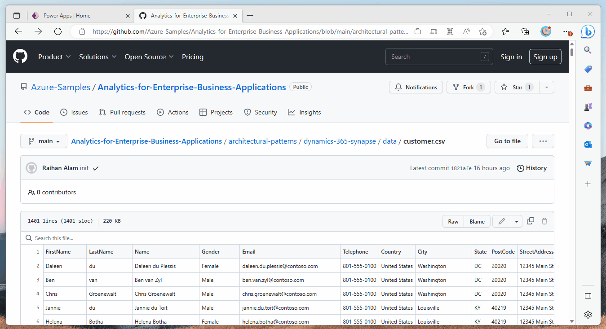
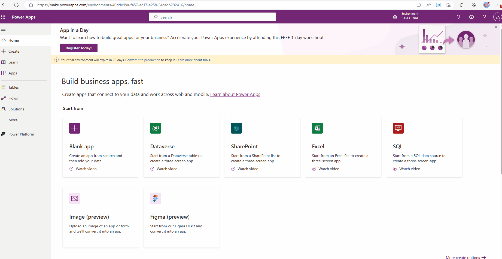
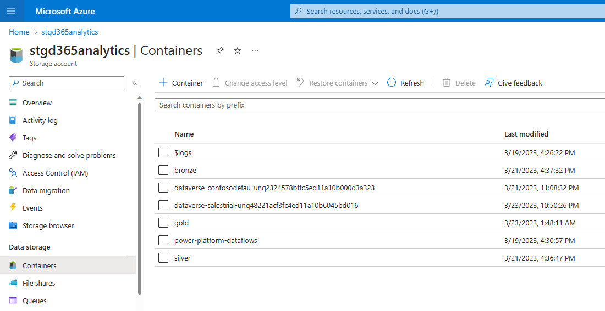

# Customer 360 - Dynamics 365 and Azure Synapse Analytics

[Microsoft Dynamics 365](https://learn.microsoft.com/en-us/dynamics365/) is a cloud-based business application platform that provides a suite of integrated solutions for customer relationship management (CRM) and enterprise resource planning (ERP), as well as other business operations such as marketing automation, sales, finance, and operations. [Dataverse](https://learn.microsoft.com/en-us/power-apps/maker/data-platform/data-platform-intro) is the data platform that underlies Dynamics 365, as well as other Microsoft applications such as Power Apps and Power BI. It is a cloud-based storage that provides a secure and scalable environment for storing and managing data, enabling users to create, share, and manage applications and data with ease.

The [Azure Synapse Analytics](https://azure.microsoft.com/products/synapse-analytics/) provides a unified set of tools for building, deploying, sharing, and maintaining enterprise-grade data solutions at scale.

This architecture will outline how to build a comprehensive customer 360 view using Azure Synapse Analytics and Microsoft Dynamics 365 Customer Insight. Synapse Analytics will be used to ingest data from multiple sources and process them, whereas CI will be used for building the unified customer profile including measures, segments, and enrichment in Customer Insights.

## Architecture Overview

This architecture presents a fictitious scenario of building a customer 360 view using Dynamics 365 Customer Insight. Generally complex use cases requires data from multiple sources. In this simplified version of this example scenario, data is coming from two source systems -

- Customer details: Name, address and other PII information are available in Dynamics 365 Sales application.
- Customer finance: Customer income, spend and other financial information is available in as a CSV file in a ADLS Gen2 container.

Azure Synapse Analytics is used to collect data from source systems, process and curate it for downstream use cases. The curated data is stored in a Synapse Analytics lake database. Customer Insight pulls this data and derives unified customer profile including measures, segments, and enrichment.

Here is the architecture diagram of the solution:

This solution follows a [medallion architecture](https://learn.microsoft.com/en-us/azure/databricks/lakehouse/medallion) which describes a series of data layers that denote the quality of data stored in the lakehouse. The terms bronze (raw), silver (validated), and gold (enriched) describe the quality of the data in each of these layers. ADLS Gen2 is used as the underlying storage layer.

Data from dataverse to the Bronze layer is loaded using [Synapse Link for Dataverse](https://learn.microsoft.com/power-apps/maker/data-platform/export-to-data-lake). Synapse Analytics jobs will process the data and move it to Silver and then Gold layer. Data in the Gold layer is served using a Synapse Analytics lake database.

Customer Insights connects to customer data from Azure Synapse lake database and implements the unified customer profile.

## Key Design Considerations

### 1. Use of Synapse Analytics for data processing

Dynamics 365 Customer Insight can pull data from multiple sources and do some data processing (deduplication, unification etc.). In many scenarios it's a perfectly valid approach.

The main reasons which drove the decision of using Synapse Analytics are -

- If the data from multiple sources are going through complex transformation which are not suitable for Customer Insight, it's recommended to use a proper analytics environment.
- It is easy keeping a historical track of all the data changes using Synapse Analytics. Historical data is important for implementing ML use cases. This can't be achieved by Customer Insight.

### 2. *Append Only* mode for Synapse Link for Dataverse

No data in the Bronze layer will be updated or deleted, data will be only added to this layer. While pulling data from dataverse, *Synapse Link for Dataverse* is using Append Only mode. In this mode, when a row in a dataverse table is deleted, it is not hard deleted from the destination. Instead, a row is added and set as *isDeleted=True* to the file in the corresponding data partition in Azure Data Lake.

### 3. Use of Synapse Analytics Lake Database

There are multiple options to build a database in Synapse Analytics, like dedicated SQL pool, lake database and serverless SQL pool. The Azure Synapse connector for Customer Insight only supports lake database to pull data. So the Gold layer is served using a lake database in Synapse Analytics.

## Technical Samples

### Prerequisite

Dynamics 365 Environment and the storage account has to be in the same Azure region.

- Dynamics 365 Sales Environment
- Dynamics 365 Customer Insight Environment
- Azure Synapse Analytics
- ADLS Gen2 Storage Account
- Data files - customer.csv and customer_finance.csv.

Steps to implement the solution are listed below.

1. Load *customer.csv* to dataverse

The *customer.csv* file is available in the data folder of this repository. Files can be uploaded to dataverse from this page - https://make.powerapps.com/. Name the new table *customer*.

2. Set up *Synapse Link for Dataverse*

*Synapse Link for Dataverse* is used to copy dataverse tables to storage account. Dataverse and the storage account have to be in the same Azure region for *Synapse Link for Dataverse* to work. This will create a container in the storage account named *dataverse-[DATAVERSE_ENVIRONMENT_NAME]-[GUID]*. Under this container, it will create a folder for the table.

3. Prepare data lake containers

Create three containers in the storage account - bronze, silver and gold.

4. Prepare RAW layer

Data from different sources will be loaded to the raw layer. While loading to raw layer, data is kept as close to the source data. The code for loading data to RAW layer is available in this notebook [prepare_bronze.ipynb](./code/prepare_bronze.ipynb)

5. Prepare SILVER layer

Once data is loaded to the RAW layer, the next step is to clean and standardize the data and load it to SILVER layer. The code for loading data to SILVER layer is available in this notebook [prepare_silver.ipynb](./code/prepare_silver.ipynb)

6. Prepare GOLD layer

The code for loading data to GOLD layer is available in this notebook [prepare_gold.ipynb](./code/prepare_gold.ipynb)

7. Import data to Customer Insight

Customer Insight will import the data from Synapse Analytics.

8. Create customer segments

## Limitations

- Currently, there is no way to set up the *Synapse Link for Dataverse* from script. So automation of this step is not possible at this stage, and it has to be done manually from the UI.

## Further Reading

- [DataOps - Modern Data Warehouse](https://www.ms-playbook.com/code-with-dataops/solutions/modern-data-warehouse/)
- [Azure Synapse Link for Dataverse](https://learn.microsoft.com/power-apps/maker/data-platform/export-to-data-lake)
