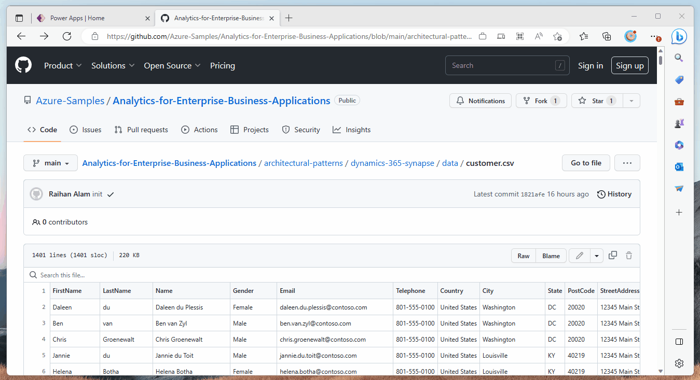
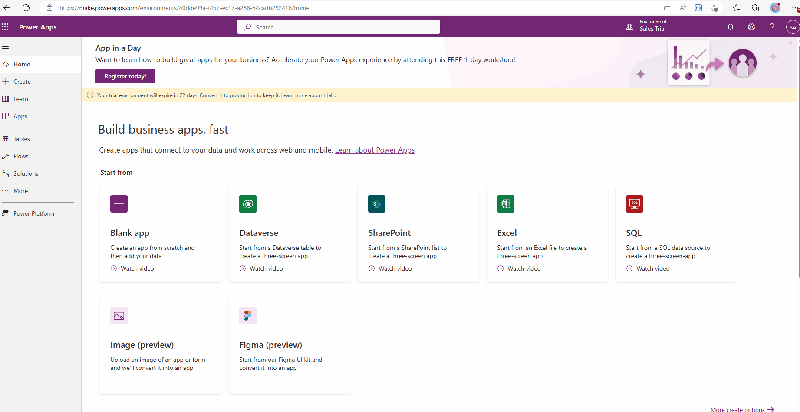

# Data Lakehouse - Dynamics 365 and Azure Databricks

[Microsoft Dynamics 365](https://learn.microsoft.com/en-us/dynamics365/) is a cloud-based business application platform that provides a suite of integrated solutions for customer relationship management (CRM) and enterprise resource planning (ERP), as well as other business operations such as marketing automation, sales, finance, and operations. [Dataverse](https://learn.microsoft.com/en-us/power-apps/maker/data-platform/data-platform-intro) is the data platform that underlies Dynamics 365, as well as other Microsoft applications such as Power Apps and Power BI. It is a cloud-based storage that provides a secure and scalable environment for storing and managing data, enabling users to create, share, and manage applications and data with ease.

The [Azure Databricks](https://learn.microsoft.com/en-us/azure/databricks/introduction/) provides a unified set of tools for building, deploying, sharing, and maintaining enterprise-grade data solutions at scale.

This architecture will outline how to implement a Data Lakehouse by ingesting data from Dataverse, enrich the data, and finally generate insights and dashboard from it.

## Architecture Overview

This architecture presents a fictitious scenario where Dynamics 365 Customer Insight (CI) is used for customer segmentation. The data necessary for customer segmentation is coming from multiple sources, and they need to go through some transformation before it can be used by Customer Insight.

Azure Synapse Analytics is used to collect data from multiple sources, process and curate it for consumption. Customer details data is ingested from Dynamics 365 Sales. Customer financial data (income, spend etc.) is loaded manually via a CSV file.

Synapse Analytics serves the processed data in a lake database. Customer Insight pulls this data and derive customer segments from it.

Here is the architecture diagram of the solution:

This solution follows a [medallion architecture](https://learn.microsoft.com/en-us/azure/databricks/lakehouse/medallion) which describes a series of data layers that denote the quality of data stored in the lakehouse. The terms bronze (raw), silver (validated), and gold (enriched) describe the quality of the data in each of these layers. ADLS Gen2 is used as the underlying storage layer.

Data from dataverse to the Bronze layer is loaded using [Synapse Link for Dataverse](https://learn.microsoft.com/en-us/power-apps/maker/data-platform/export-to-data-lake). Synapse Analytics jobs will process the data and move it to Silver and then Gold layer.

## Key Design Considerations

- Unlike this solution where Dataverse data is ingested to a lakehouse, data from Dataverse can be directly fetched by Power BI to develop reports/dashboards as well - [Use Power BI with Microsoft Dataverse data
](https://learn.microsoft.com/en-us/power-apps/maker/data-platform/use-powerbi-dataverse). And in many scenarios that's a perfectly valid approach.

  But if the data from the Dataverse is going through complex transformation which are not suitable for Power BI, it's recommended to use a proper analytics environment like a lakehouse. Complex transformation often slows down the Power BI report/dashboards. Also complex transformation logic in Power BI may become unmaintainable.

  Another reason for using the lakehouse is, it is keeping a historical track of all the changes in the Dataverse, which is important for many analytics use cases. This can't be achieved by Power BI.

- No data in the Bronze layer will be updated or deleted, data will be only added. To achieve this, Synapse Link for Dataverse is using Append Only mode. In this mode, when a Dataverse table row is deleted, it is not hard deleted from the destination. Instead, a row is added and set as *isDeleted=True* to the file in the corresponding data partition in Azure Data Lake.

- The databricks jobs are implemented using Delta Live Table to process the data in near real-time.

## Solution

### Prerequisite

Dynamics 365 Environment and the storage account has to be in the same Azure region.

- Dynamics 365 Sales Environment
- Dynamics 365 Customer Insight Environment
- Azure Synapse Analytics
- ADLS Gen2 Storage Account
- Data files - customer.csv and customer_finance.csv.

Steps to implement the solution are listed below.

1. Load *customer.csv* to dataverse

The *customer.csv* file is available in the data folder of this repository. Files can be uploaded to dataverse from this page - https://make.powerapps.com/. Name the new table *customer*.

2. Set up *Synapse Link for Dataverse*

*Synapse Link for Dataverse* is used to copy dataverse tables to storage account. Dataverse and the storage account have to be in the same Azure region for *Synapse Link for Dataverse* to work. This will create a container in the storage account named *dataverse-[DATAVERSE_ENVIRONMENT_NAME]-[GUID]*. Under this container, it will create a folder for the table.

3. Prepare data lake containers

Create three containers in the storage account - bronze, silver and gold.

4. Prepare RAW layer

Data from different sources will be loaded to the raw layer. While loading to raw layer, data is kept as close to the source data. The code for loading data to RAW layer is available in this notebook [prepare_bronze.ipynb](./code/prepare_bronze.ipynb)

5. Prepare SILVER layer

Once data is loaded to the RAW layer, the next step is to clean and standardize the data and load it to SILVER layer. The code for loading data to SILVER layer is available in this notebook [prepare_silver.ipynb](./code/prepare_silver.ipynb)

6. Prepare GOLD layer

The code for loading data to GOLD layer is available in this notebook [prepare_gold.ipynb](./code/prepare_gold.ipynb)

7. Import data to Customer Insight

Customer Insight will import the data from Synapse Analytics.

8. Create customer segments

## Limitations

- There is no way to set up the Synapse Link for Dataverse from scripts. So automation of this step is not possible at this stage, and it has to be done manually from the UI.

## Further Reading

- [Azure Synapse Link for Dataverse](https://learn.microsoft.com/power-apps/maker/data-platform/export-to-data-lake)
- [Getting Started with Delta Live Tables](https://www.databricks.com/discover/pages/getting-started-with-delta-live-tables)
